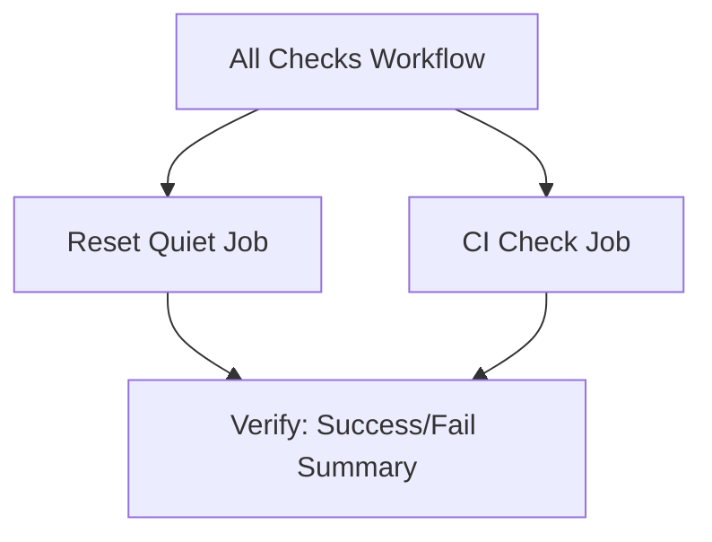
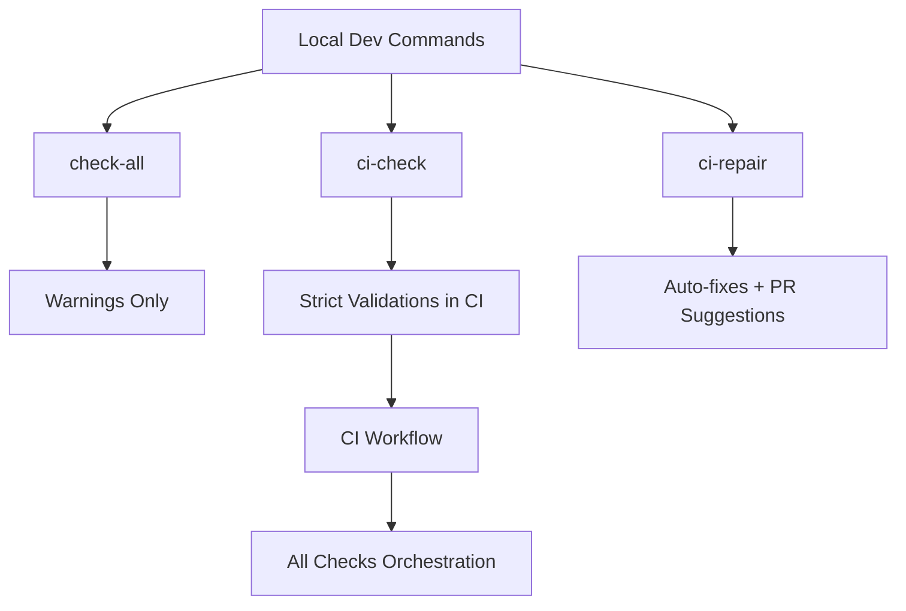

# 🌍 Nouvo Ayiti 2075 Blogs


Welcome to the **Nouvo Ayiti 2075 Blogs** repository.  
This project powers our multilingual blog platform with **full validation, CI/CD, and automated Git workflows**.

---

## 🚀 Live Site

👉 [https://nouvo-ayiti-2075-blogs.vercel.app](https://nouvo-ayiti-2075-blogs.vercel.app)

---

## 🛡️ Workflow Status

| Workflow             | Badge | Purpose |
|----------------------|-------|---------|
| **All Checks**       |  | Orchestrates Reset Quiet + CI Check. Ensures both succeed before merge. |
| **Reset Quiet**      |  | PowerShell-based reset + dictionary sync. Produces per-run logs as artifacts. |
| **CI Check**         |  | Node.js validations: lint, coverage, strict dictionary checks. Blocks merges if failing. |
| **Validate Dicts**   |  | Ensures dictionaries remain consistent across locales. |

> ✅ Artifacts are named with `<env>-<run_number>-<timestamp>` for clarity.

---

## 📦 Artifact Conventions

- **Reset Quiet**  
  ```
  reset-summary-<env>-<run_number>-<timestamp>
  ```
- **All Checks**  
  ```
  all-checks-summary-<env>-<run_number>-<timestamp>
  ```

Retention policy:  
- `prod` → 90 days  
- `dev` / `staging` → 30 days  

Direct download links are printed in job logs for convenience.

---

## 📊 Workflow Orchestration



- **All Checks** runs both **Reset Quiet** and **CI Check**.  
- **Verify** only passes if **both jobs succeed**.  
- Failure summaries link to the logs of the failing job(s).

---

## 📊 Local → CI Flow



- **check-all** → Friendly local run, warnings only.  
- **ci-check** → Strict validations (same rules as CI).  
- **ci-repair** → Runs auto-fixes, helps prepare code for PRs.  
- CI Workflow results are orchestrated into **All Checks**.  

---

## 🧭 Developer Setup

### Install dependencies
```bash
npm install
```

### Run checks locally
```bash
npm run check-all
```

### Run strict CI check locally
```bash
npm run ci-check:dry-run
```

---

## 🛠️ Contributor Guide

This project uses **Husky Git Hooks** to enforce quality and sync automatically.  
When you commit, push, or merge, the following checks run:

| Hook           | Runs                                      | Purpose |
|----------------|-------------------------------------------|---------|
| **pre-commit** | `npm run ci-check` + `npx lint-staged`    | Prevents bad commits (lint/tests must pass). |
| **pre-push**   | `npm run ci-check`                        | Blocks pushes if CI sanity fails. |
| **post-commit**| Commit summary + optional dictionary stats | Friendly feedback, quick stats, no blocking. |
| **post-merge** | `check-dicts`, `export-combined`, `check-sync` | Auto-validates after merge, keeps dictionaries and CSVs consistent. |

---

## ✅ Developer Workflow

1. **Edit / Commit** → pre-commit runs lint + validation.  
2. **Push** → pre-push ensures no bad code leaves your branch.  
3. **PR / Merge** → GitHub Actions + post-merge re-validate everything.  
4. **After Commit** → post-commit gives feedback and dictionary stats.  

---

## ⚠️ Common Issues

- **Missing dictionary key** → Run:
  ```bash
  npm run patch-missing
  ```

- **Lint errors** → Run:
  ```bash
  npm run lint --fix
  ```

---

## 🧪 Running Checks Manually

```bash
# Run all checks locally
npm run check-all

# Run CI validation
npm run ci-check

# Repair dictionaries
npm run ci-repair
```

---

## 📖 Documentation

See the full workflow guide: [workflow.md](./workflow.md)

---

✍️ Maintained by **Nouvo Ayiti 2075 Team**
