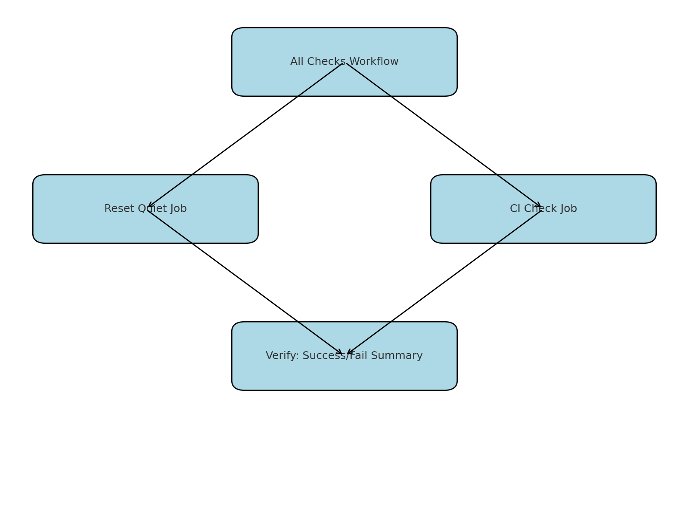
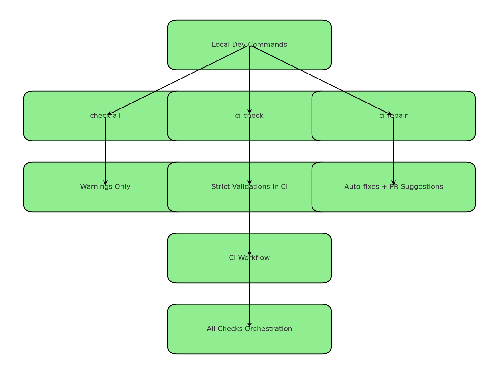

# 🌍 Nouvo Ayiti 2075 Blogs

Welcome to the **Nouvo Ayiti 2075 Blogs** repository.  
This project powers our multilingual blog platform with full validation, CI/CD, and reset workflows.

---

## 🚀 Live Site

👉 [https://nouvo-ayiti-2075-blogs.vercel.app](https://nouvo-ayiti-2075-blogs.vercel.app)

---

## 🛡️ Workflow Status

| Workflow        | Badge | Purpose |
|-----------------|-------|---------|
| **All Checks**  |  | Orchestrates Reset Quiet + CI Check. Ensures both succeed before merge. |
| **Reset Quiet** |  | PowerShell-based reset + dictionary sync. Produces per-run logs as artifacts. |
| **CI Check**    |  | Node.js validations: lint, coverage, strict dictionary checks. Blocks merges if failing. |

> ✅ Artifacts are named with `<env>-<run_number>-<timestamp>` for clarity.

---

## 📦 Artifact Conventions

- **Reset Quiet**  
  ```
  reset-summary-<env>-<run_number>-<timestamp>
  ```
- **All Checks**  
  ```
  all-checks-summary-<env>-<run_number>-<timestamp>
  ```

Retention policy:  
- `prod` → 90 days  
- `dev` / `staging` → 30 days  

Direct download links are printed in job logs for convenience.

---

## 🔍 Quick Reference Table

| Workflow        | Trigger             | Artifacts                                     | Retention | Summary Output |
|-----------------|---------------------|-----------------------------------------------|-----------|----------------|
| **All Checks**  | PRs / Pushes / Manual | `all-checks-summary-<env>-<run>-<ts>`        | 90d prod / 30d others | ✅/❌ with links to failing jobs |
| **Reset Quiet** | PRs / Pushes / Manual | `reset-summary-<env>-<run>-<ts>`             | 90d prod / 30d others | ✅/❌ summary tab + logs |
| **CI Check**    | PRs / Pushes         | (no artifacts, strict validation only)        | N/A       | Inline ESLint + Prettier comments |

---

## 📊 Workflow Orchestration

This shows how **All Checks** orchestrates Reset Quiet and CI Check.



- **All Checks** runs both **Reset Quiet** and **CI Check**.  
- **Verify** only passes if **both jobs succeed**.  
- Failure summaries link to the logs of the failing job(s).

---

## 📊 Local → CI Flow

This shows how local developer commands connect into the CI pipelines.



- **check-all** → Friendly local run, warnings only.  
- **ci-check** → Strict validations (same rules as CI).  
- **ci-repair** → Runs auto-fixes, helps prepare code for PRs.  
- CI Workflow results are orchestrated into **All Checks**.  

---

## 🧭 Developer Setup

### Install dependencies
```bash
npm install
```

### Run checks locally
```bash
npm run check-all
```

### Run strict CI check locally
```bash
npm run ci-check:dry-run
```

---

## ⚠️ Common Issues

- **Missing dictionary key** → Run:
  ```bash
  npm run patch-missing
  ```

- **Lint errors** → Run:
  ```bash
  npm run lint --fix
  ```

---

## 📖 Documentation

See the full workflow guide: [workflow.md](./workflow.md)

---

✍️ Maintained by **Nouvo Ayiti 2075 Team**
