# 🛠 Workflow Guide — Nouvo Ayiti 2075 Blogs

This document explains how to maintain and validate the **Nouvo Ayiti 2075 Blogs** project using our hybrid scripting setup.  
We use **Node.js scripts** for cross-platform checks and patches, and **PowerShell scripts** for targeted resets.

---

## 🚀 Contributor Quickstart

Welcome! 🎉 Follow these steps to get your environment ready and ensure your changes pass all checks.

### 1. Install dependencies

```bash
npm install
```

### 2. Run local checks before committing

```bash
npm run check-all
```

This validates:
- Translation dictionaries
- Metadata
- Required-only keys
- Topbar/Footer sync
- Coverage

---

## 📦 Prerequisites

- **Node.js v22+**  
- **npm**  
- **PowerShell 7 (pwsh)** or Windows PowerShell  

---

## 🔍 Validation & Checks (Node.js)

### Local Friendly Checks
```bash
npm run check-all
```
→ Non-strict, warnings only. Use before committing.

### Strict CI Validation
```bash
npm run ci-check
```
→ Enforces strict validation (fails on missing keys, invalid translations, lint/coverage issues).

### Auto-Repair in CI
```bash
npm run ci-repair
```
→ Patches missing keys/sections, then re-runs strict checks.

---

## 🧭 Local vs CI Flow (Visual)

```mermaid
flowchart TD
    subgraph Local["💻 Dev Mode: check-all (non-strict)"]
        L1[🧹 clean] --> L2[🔍 check-all]
        L2 --> L3[📝 lint]
        L3 --> L4[📊 coverage]
    end

    subgraph CI["🛡️ CI Mode: ci-check (strict)"]
        C1[🧹 clean] --> C2[🔍 check-all:strict 🚫]
        C2 --> C3[📝 lint 🚫]
        C3 --> C4[📊 coverage:strict 🚫]
    end

    subgraph Repair["🔧 CI Mode: ci-repair (auto-fix)"]
        R1[🛠 repair:force] --> R2[🔍 check-all:strict]
        R2 --> R3[📝 lint]
        R3 --> R4[📊 coverage:strict]
    end
```



---

## ✅ Workflow Summary

| Command                   | Context      | Strict? 🚫 | Auto-Fix? 🔧 | Purpose 📝 |
|---------------------------|--------------|------------|--------------|------------|
| `npm run check-all`       | Local Dev    | No ❌       | No ❌         | Run all validations. Friendly, warnings only. |
| `npm run ci-check`        | CI Pipeline  | Yes ✔️      | No ❌         | Strict validation, blocks merges if failing. |
| `npm run ci-repair`       | CI Pipeline  | Yes ✔️      | Yes 🔧        | Auto-fix issues, then strict re-check. |
| `npm run lint`            | Both         | Yes ✔️      | No ❌         | Enforce coding standards with ESLint. |
| `npm run coverage`        | Both         | Yes ✔️      | No ❌         | Enforce minimum test coverage. |
| `npm run ci-check:dry-run`| Local Dev    | Yes ✔️      | No ❌         | Simulate CI checks locally. |

---

## ⚠️ Common Errors & Fixes

### 1. ❌ Missing Dictionary Key
- **Error:**  
  `Missing key "hero.title" in fr.json`
- **Cause:**  
  Key exists in `en.json` but is missing in another locale file.
- **Fix:**  
  ```bash
  npm run patch-missing
  ```

---

## 🔄 Reset Quiet Workflow (PowerShell + GitHub Actions)

This workflow ensures translation dictionaries and metadata stay consistent.  
It complements Node.js validation by chaining three PowerShell scripts:

- `postreset.ps1` → cleans and prepares state  
- `sync-dicts.ps1` → synchronizes translation dictionaries  
- `validate-and-repair-json.ps1` → validates JSON and auto-repairs  

### 🚀 How to Run

1. Go to the **Actions** tab.  
2. Select **Reset Quiet**.  
3. Click **Run Workflow**, choose the environment (`dev`, `staging`, `prod`).  

### 📦 Logs & Artifacts

Each run:
- Prints phase timings (Reset, Sync, Validate).  
- Produces logs in `logs/`:  
  - `reset-summary.log` → cumulative history  
  - `reset-summary-run<runNumber>-<timestamp>.log` → per-run log  

Artifacts uploaded with pattern:  
```
reset-summary-<env>-<run_number>-<timestamp>
```

Retention:  
- `prod` → 90 days  
- `dev`/`staging` → 30 days  

---

## 🔄 All Checks Workflow (CI + Reset Quiet)

This workflow orchestrates **Reset Quiet** + **CI Check**.  
It ensures both succeed before merges.

### 🚀 Trigger
- PRs to `main` / `develop`  
- Pushes to `main` / `develop`  
- Manual dispatch  

### 📦 Artifacts
```
all-checks-summary-<env>-<run_number>-<timestamp>
```

Includes:
- Environment used  
- Retention days  
- Run number + timestamp  
- ✅ Success / ❌ Failure status  

Retention:  
- `prod` → 90 days  
- `dev`/`staging` → 30 days  

---

## 🔗 Orchestration Flow

```mermaid
flowchart TD
    subgraph AllChecks["🛡️ All Checks Workflow"]
        A1[🔄 Reset Quiet] --> A3[✅ Verify]
        A2[🛠 CI Check] --> A3
    end
```



- **All Checks** waits for both **Reset Quiet** and **CI Check**.  
- Only if both pass, the Verify step marks success.  
- Failure summaries include direct links to failing job logs.  

---

📌 **Guidelines Recap**:
- Use **`check-all`** locally → see issues without blocking.  
- CI enforces **`ci-check`** on PRs → blocks merges on failure.  
- **Reset Quiet** → keeps translations/metadata in sync.  
- **All Checks** → ensures Reset + CI succeed before merge.  
- Artifacts are uniquely named (`<env>-<run_number>-<timestamp>`) to avoid overwrites.
