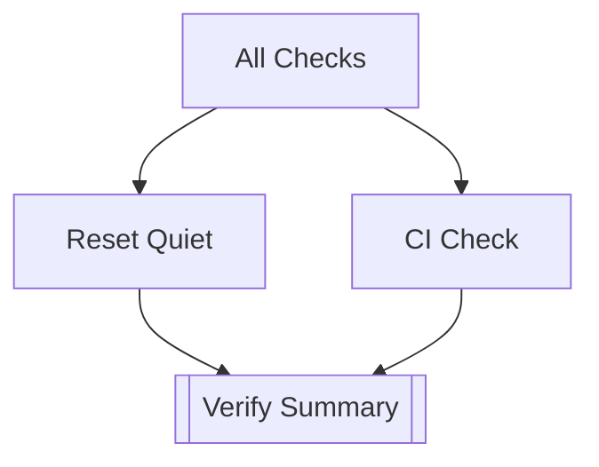

<# 🌍 Nouvo Ayiti 2075 — Full Technical Documentation


This repository hosts the **Nouvo Ayiti 2075 Blogs Platform**, a multilingual content system powered by:

- Next.js App Router
- Automated dictionary validation
- CI/CD workflows
- PowerShell repair/reset pipelines
- Multi-locale synchronization
- Asset/version orchestration

It provides a robust development, deployment, and validation environment aligned with the broader Nouvo Ayiti vision of transparency, resilience, and long-term maintainability.

---

## 📁 Repository Structure

```
nouvo-ayiti-2075-blogs/
│
├─ app/                      # Next.js App Router pages
├─ components/               # Shared UI + page components
├─ content/                  # Markdown posts per locale
├─ public/                   # Static images/assets
├─ lib/                      # Data loading, dictionaries, helpers
├─ scripts/                  # PowerShell + Node validation utilities
├─ .github/workflows/        # CI/CD automation
└─ README.md
```

---

## 🚀 Live Deployment (Production)

**Main site:**  
https://nouvo-ayiti-2075-blogs.vercel.app

**Preview deployments:**  
Generated automatically on GitHub pull requests.

---

## 🛡️ CI/CD Workflows (Full Overview)

### **1️⃣ All Checks Workflow**

Orchestrates:

- Reset Quiet
- CI Check

Flow:



### **2️⃣ Reset Quiet**

- Syncs dictionaries
- Runs PowerShell-based validators
- Produces artifacts with detailed logs

### **3️⃣ CI Check**

Node-powered strict validation:

- ESLint
- TypeScript
- Dictionary validity
- Locale coverage
- Build check
- Coverage thresholds

### **4️⃣ Validate Dicts**

Ensures CSV → JSON → locale metadata stays consistent.

---

## 🔧 Local Developer Commands

| Purpose                    | Command                    |
| -------------------------- | -------------------------- |
| Run all validations (soft) | `npm run check-all`        |
| Run strict CI pipeline     | `npm run ci-check:dry-run` |
| Repair dictionaries        | `npm run repair`           |
| Reset everything silently  | `npm run reset:quiet`      |
| Sync dictionaries          | `npm run sync`             |
| Lint code                  | `npm run lint`             |

---

## 🧠 Dictionary & Localization System

Your project supports **EN, FR & HT** locales with automated:

- Missing key detection
- Auto-merging incremental dictionaries
- CSV export/import
- Consistency checks across locales
- "Minimal dictionary" regeneration

Artifacts are produced on every run for auditing.

---

## 🚨 Troubleshooting

### ❗ TOO_MANY_REDIRECTS

Ensure `middleware.ts` only rewrites missing locale paths.

### ❗ Missing keys

```
npm run patch-missing
```

### ❗ Lint / Build failures

```
npm run lint --fix
npm run build
```

---

## 📘 Full Documentation

See: `workflow.md`, `SECURITY.md`, and the `scripts/` folder for granular technical references.

---

✍️ Maintained by **Justine Longla T & Nouvo Ayiti 2075 Team**
paste the full technical readme content here>
