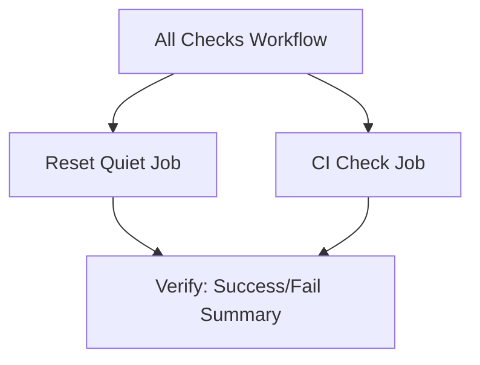
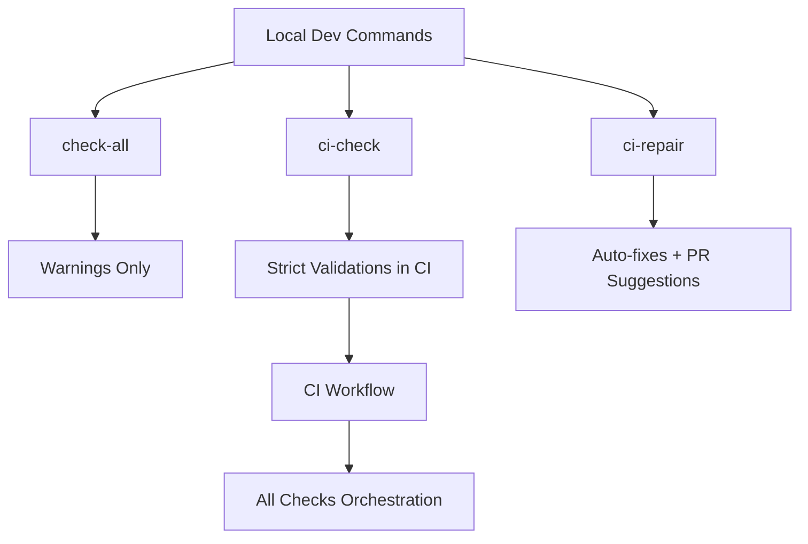

# 🛠 Workflow Guide

This document explains the CI/CD and validation workflows used in the **Nouvo Ayiti 2075 Blogs** project.

---

## 📊 Workflow Orchestration

Below is the **source (Mermaid)** and the **rendered PNG preview**.

### Mermaid Source (editable)

### Rendered Preview

---

## 📊 Local → CI Flow

Below is the **source (Mermaid)** and the **rendered PNG preview**.

### Mermaid Source (editable)

### Rendered Preview

---

## 🔑 Key Notes

- **Mermaid blocks** → Editable, for maintainers.  
- **PNG previews** → Always render on GitHub.  
- Artifacts and retention rules are documented in [README.md](./README.md).

---

✍️ Maintained by **Nouvo Ayiti 2075 Team**
